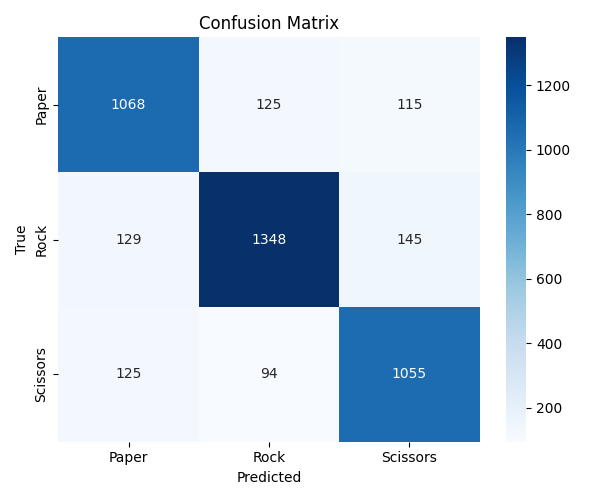

# 🖐️ Hand RPS Recognition

Rock-Paper-Scissors gesture recognition using real-time webcam input and a Convolutional Neural Network (CNN) model trained with TensorFlow and Mediapipe.


---

## 📌 Project Overview

This project is a computer vision-based game that detects hand gestures via webcam to classify them as **Rock**, **Paper**, or **Scissors**. Built using:

- 🔍 **TensorFlow/Keras** for model training
- ✋ **MediaPipe** for hand detection & landmark tracking
- 🎮 **OpenCV** for real-time camera interaction
- 📊 **Matplotlib & Seaborn** for visualization
- 🎯 Optionally deployed on **Hugging Face Spaces**

---

## 📂 Folder Structure
<pre>[rock-paper-scissors-ml/
├── model/
│   ├── rps_model.h5
│   ├── classification_report.txt
│   ├── confusion_matrix.png
│   └── training_metrics.png
│
├── src/
│   ├── real_time_game.py
│   ├── evaluate_model.py
│   └── app.py
│
├── utils/
│   └── preprocessor.py
│
├── data/
│   └── (kosong / isi dataset, tapi jangan diupload langsung)
│
├── LICENSE.txt
├── README.md
├── requirements.txt
└── .gitignore</pre>

## 🧪 Evaluation Results (Sample)

> 📍 You can update this section with the latest results from `evaluate_model.py`

**Accuracy**: `94.32%`

**Confusion Matrix:**




**Classification Report:**
paper: precision=0.95, recall=0.94, f1-score=0.94

rock: precision=0.93, recall=0.95, f1-score=0.94

scissors: precision=0.95, recall=0.94, f1-score=0.94

yaml
Salin
Edit

---

## 🎮 Real-Time Game Features

- Detects **2 hands simultaneously**
- Recognizes **Rock, Paper, or Scissors**
- Determines **Winner** per round
- Keeps **score**, and asks to continue or replay
- Optionally logs predictions and confidence level

🎥 Press **'q'** to quit game  
🔁 Press any key to start next round

---

## 🚀 Deployment

### 📦 Requirements

Install dependencies:

```
pip install -r requirements.txt
Sample requirements.txt:

nginx
Salin
Edit
tensorflow
opencv-python
mediapipe
numpy
matplotlib
seaborn
gradio

```

📚 References
Mediapipe by Google

TensorFlow Keras Docs

Gradio Interface

Dataset from: Rock Paper Scissors - Labeled Image Dataset on Kaggle

📃 License
This project is licensed under the MIT License.
See the LICENSE file for more information.
```
🙌 Author
👤 Riel0303ru
GitHub: @Riel0303ru
```
